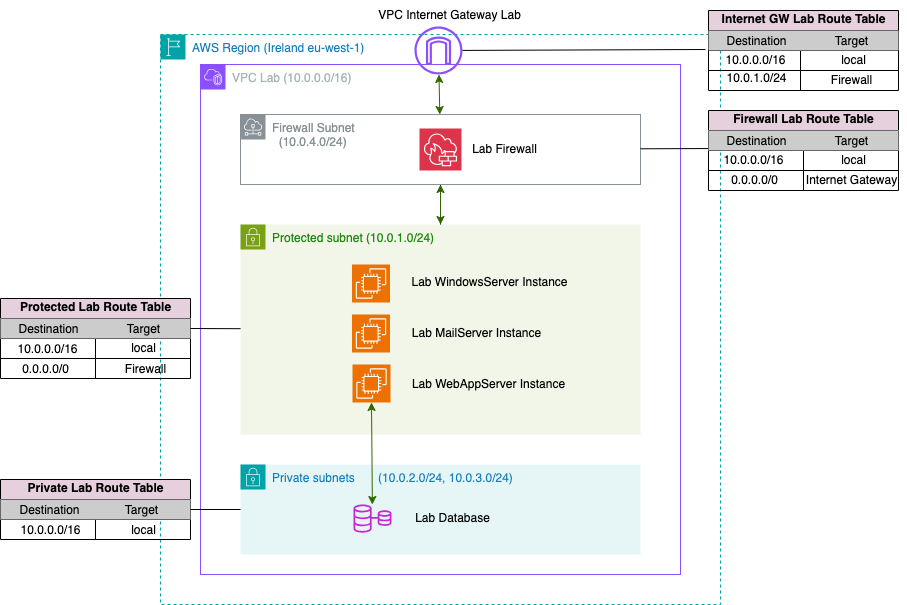

# CyberSecurity Lab

Repository created for training purpose. And to be analyzed after that using a SIEM system:

The infrastructure includes:
- **Firewall**: AWS Network Firewall and Security Groups on the instances.
- **Linux server** with Ubuntu AMI.
- **RDS service.**
- **Linux server** wuth Amazon Linux AMIA.
- **Windows server** with Windows Server 2016 AMI

## Lab Diagram



## Terraform Infrastructure as Code (IaC) Repository

This repository contains Terraform code to provision and manage infrastructure on Amazon Web Services using Infrastructure as Code (IaC) principles.

### Prerequisites

Before you begin, ensure you have the following tools installed:

- [Terraform](https://www.terraform.io/downloads.html)
- [AWS CLI](https://aws.amazon.com/cli/)
- An [AWS account](https://aws.amazon.com/free/?all-free-tier) and the [associated credentials](https://docs.aws.amazon.com/IAM/latest/UserGuide/security-creds.html) that allow you to create resources. These credentials must be configured for the AWS provider (see [Authentication and Configuration](https://registry.terraform.io/providers/hashicorp/aws/latest/docs#authentication-and-configuration) section in AWS terraform provider documentation.)

### Related Repositories

Repository which include basic infrastructure to deploy a SIEM: [Infrastructure for Wazuh SIEM](https://github.com/xavierventeo/terraform-wazuh-aws-ec2-elastic-ip)

### Usage

1. Clone this repository to your local machine:

```bash
git clone git@github.com:xavierventeo/cybersecurity-lab.git
```

2. Navigate to the repository directory:

```bash
cd cybersecurity-lab
```

3. Initialize Terraform:

```bash
terraform init
```

4. Configure terraform variables with your own values

```bash
cp terraform.tfvars.example terraform.tfvars
vi terraform.tfvars
```

5. Plan the infrastructure changes:

```bash
terraform plan
```

6. Apply the infrastructure changes to your AWS Account:

```bash
terraform apply
```

Confirm the action by typing 'yes' when prompted.

### Cleanup

To destroy the infrastructure provisioned by Terraform, run:

```bash
terraform destroy
```

Confirm the action by typing 'yes' when prompted.